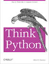

# Learn Python

We will work with Python (2.7) throughout the course, and getting
familiar with Python is crucial.

[](http://www.greenteapress.com/thinkpython/)

## Python Tutorial

To get familiar with Python, please follow
[Dive into Python](http://www.diveintopython.net/toc/index.html),
Chapters 2 through 6. You can download the PDF version, or
[follow it online](http://www.diveintopython.net/toc/index.html).

Of course, depending on your experience with Python, you can skip
parts or the entire tutorial. However, if you are not already very
familiar with using python, we believe that this tutorial will be very
useful.


##### Note on the interpreter

If you never used the Python interpreter before,
[this page](http://www.diveintopython.net/installing_python/shell.html)
explains how it works. You run the interpreter by just entering

```bash
python
```

on the command line.

When running the programs in the tutorial, try writing/editing them in
Emacs, and run them from the command line:

```bash
python my_test_program.py
```

How long the tutorial will take depends on how familiar you are with
Python.

After you're done, (and hopefully you will have done the exercises in the book!),
please go ahead and complete the following exercises:
_**Each answer should be submitted in the appropriate file**_

[Strings](python/exercise_01.py)
[Strings](python/exercise_01b.py)
[Lists](python/exercise_02.py)
[Lists](python/exercise_02b.py)
[Dict and File](python/exercise_03.py)

_All exercises are from Google's Python Course and are licensed for distrubution under the Apache License, Version 2.0_


##### Note for brand new programmers

If Dive into Python feels overwhelming and you really need
to brush your basic programming concepts, you can follow
[Learn Python The Hard Way](http://learnpythonthehardway.org/book/)
(or alternatively
[The Python Tutorial](https://docs.python.org/2/tutorial/)). You will
go through the basic concepts like loops, if conditions, etc., but it
is a much longer process.


##### Note for experienced coders in other languages

If you are very confident about your programming skills and code
almost daily, but never really coded in Python, and want to know how
to tackle specific coding scenarios in Python, you can look into
further chapters in Dive into Python, or use the free online resources
listed [here](https://wiki.python.org/moin/BeginnersGuide/Programmers).
