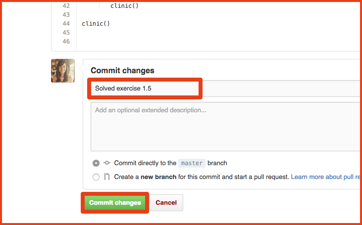

# How to Work with GitHub

## Step 1: Sign up for GitHub

You will need a GitHub account.

It's easy and free to [sign up](https://github.com/join).

## Step 2: Sign in to GitHub

Make sure that you are [signed in](https://github.com/login) to GitHub.

## Step 3: Work with GitHub

You can do everything through GitHub's web interface.

### Step 3a: Fork this repository

Click the **Fork** button at the upper right hand corner of the page:

This makes a personal copy of the repository that you can edit. Your forked copies will show up in your *Repositories* section.

This repository is `thisismetis/dsprework`. Your forked copy will be `your_github_user_name/dsprework`.

### Step 3b: Edit your fork

There are files in the repository that you need to edit to add your work.

When viewing an individual file in your forked repository on GitHub, you will an see "Edit this file" button that you can click to get an in-browser editor.

After you've edited the file, you need to _commit_ your changes. At the bottom of the page you can add a _commit message_ describing your changes and then click the green "Commit changes" button.

You can repeat the edit and commit process as many times as you like!

#### To submit through the terminal

__*CLI knowledge is necessary*__

This will give you an overview of some very basic Git functionality, including **cloning, adding, committing and pushing.**

**Set up Git**

__Only applicable if you've never used Git before__

1. [Download Git](http://git-scm.com/downloads)
2. Go to the terminal. Type:

`git config --global user.name "YOUR NAME"`
`git config --global user.email "YOUR EMAIL ADDRESS"`

**Create a local clone of your fork**

Right now, you've got a copy of the pre-work repository, but you do not have the files on your computer. This is where a **clone** comes in.

1. In your fork of the pre-work repository, go the the right sidebar and click on the icon to copy the clone URL.
2. On the terminal, type `git clone` and paste the URL. It should look like this now:
`git clone https://github.com/YOUR_USERNAME/dsprework.git`  Press Enter.

You've now got a copy of the pre-work in your computer.

**Sumbitting your work**

Once you are done writing out your answer, you will have to do three things in the terminal:
**DO THIS AFTER EVERY ANSWER**

1. **Add** your work. Type:

`git add .`
_The dot after the word add will add all the files that you've modified._

The file name you just modified should show up. It will say something like:

`modified: python.md`

2. **Commit** your work. Type:

`git commit -m 'brief description of commit'`

3. **Push** your work up to GitHub. Type:

`git push origin master`

You're done! Your answer is now in Github and ready for our feedback.
